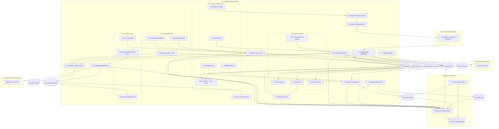

# Project Latitude V1.0 — Shaping

## Context Card

## Use this when
You are shaping, slicing, or implementing the first vibe-codeable version of **Project Latitude**: a voice/text-led AI shaping canvas that turns rough product intent into a visible, typed, buildable blueprint.

## Must preserve
- Requirements stay distinct from solution shapes.
- `A: Local AI shaping canvas` is the selected V1 direction.
- V1 must be buildable by Codex for a non-technical founder.
- V1 focuses on shaping before implementation, not high-fidelity prototyping.
- Stable IDs: R#, A#, P#, U#, C#, D#, S#.

## Ignore unless asked
- Full Miro integration.
- Multiplayer/collaboration.
- Real-time AI cursor presence.
- MCP/GitHub automation.
- High-fidelity mockups or generated production apps.

---

## Entry Point

Starting from **Shapes (S)** because the source idea already names a solution concept: **Project Latitude = a voice-led AI shaping editor on a canvas**. I extracted Requirements (R) from that concept so we can check whether the V1 shape actually fits.

---

## Problem / Outcome

| Field | Draft |
|---|---|
| Problem | Non-technical and semi-technical builders can now ask coding agents to generate software, but their product intent often stays vague, linear, and under-shaped. This creates unwanted screens, unclear flows, bloated scope, and repeated “that’s not what I meant” loops. |
| Outcome | A builder can describe a product idea in plain language and end with a visible, editable, structured product blueprint that is clear enough to hand to Codex for a first implementation slice. |
| V1 Bet | Do not build “AI prototype generation.” Build the missing definition layer: rough intent → typed canvas structure → slices → Codex-ready context packet. |

---

## Constraints

| ID | Constraint |
|---|---|
| K1 | V1 must be feasible for a non-technical user to vibe code with Codex. |
| K2 | V1 should run as a single small web app, not as a production Miro app. |
| K3 | V1 should not depend on multiplayer, auth, cloud database, or Miro APIs. |
| K4 | V1 must have a demo path that can be completed locally. |
| K5 | V1 should use plain language and editable objects, not require the user to understand code or schemas. |
| K6 | V1 should prefer low-fidelity structure over polished UI mockups. |
| K7 | V1 should preserve enough structured context that a coding agent can build the next slice without guessing. |

---

## Requirements (R)

| ID | Requirement | Status |
|---|---|---|
| R0 | A non-technical or semi-technical builder can describe a product idea in plain language and see it become visible product structure. | Core goal |
| R1 | The workspace must be spatial enough to show screens, actions, flows, rules, data, risks, and slices at once instead of only as a linear chat. | Must-have |
| R2 | Canvas artifacts must be typed so the app and downstream agents can tell whether an item is a requirement, place/screen, user action, system rule, data object, risk, open question, slice, or acceptance check. | Must-have |
| R3 | The user must be able to inspect and edit the shaped blueprint directly without touching implementation code. | Must-have |
| R4 | The output must become a build contract for Codex: requirements, typed canvas objects, relationships, explicit vertical slices, demo scripts, verification checks, and non-goals. | Must-have |
| R5 | The V1 must be simple enough for Codex to implement as one small web app for a non-technical user. | Must-have |
| R6 | The product must avoid premature high-fidelity design/prototype generation and focus on low-fidelity shaping. | Must-have |
| R7 | The tool must preserve enough intent and shaping history that the user is not left with a mysterious generated artifact. | Must-have |
| R8 | The MVP must have an obvious demo path: idea in → typed canvas → editable blueprint → export packet → first build slice ready. | Must-have |

---

## CURRENT: Linear Prompt / Doc Handoff

| Part | Mechanism | Flag |
|---|---|:---:|
| CURRENT1 | User writes a long prompt or shaping doc in a linear editor. | |
| CURRENT2 | User pastes the whole prompt into Codex or another coding agent. | |
| CURRENT3 | Any diagrams, flows, or relationships must be described in prose. | |
| CURRENT4 | Agent output is reviewed after generation; the user works backward from code or screens. | |

---

## Candidate Solution Shapes

## A: Local AI Shaping Canvas (selected V1)

| Part | Mechanism | Flag |
|---|---|:---:|
| A1 | Single-session web app with a left input lane, center spatial canvas, right inspector/export lane. | |
| A2 | Plain-language input accepts typed text first and optional browser dictation second; each turn is saved as shaping history. | |
| A3 | AI structuring action converts the latest turn plus current blueprint into validated canvas operations: add/update typed cards, connectors, questions, and candidate slices. | |
| A4 | Spatial canvas renders typed draggable cards and connector lines for requirements, places/screens, actions, rules, data objects, risks, questions, slices, and acceptance checks. | |
| A5 | Inspector lets the user edit card type, title, body, status, and relationships directly. | |
| A6 | Export composer turns the current blueprint into a Codex-ready Markdown context packet with requirements, non-goals, slice list, demo script, and verification checks. | |
| A7 | Local persistence saves the transcript, cards, connectors, slices, and export packet in the browser so refresh does not erase the session. | |

## B: Miro App / MCP Prototype

| Part | Mechanism | Flag |
|---|---|:---:|
| B1 | Runs inside Miro using existing board objects as typed shaping artifacts. | ⚠️ |
| B2 | Uses Miro canvas, connectors, comments, and board persistence. | ⚠️ |
| B3 | Adds AI teammate controls inside the board for structuring conversations into typed objects. | ⚠️ |
| B4 | Exports or syncs the board through MCP/GitHub/Codex handoff. | ⚠️ |

## C: Chat-First Shaping Assistant

| Part | Mechanism | Flag |
|---|---|:---:|
| C1 | Chat interface asks shaping questions and records answers. | |
| C2 | Assistant generates requirements, shapes, breadboard, and slices as Markdown. | |
| C3 | Preview area shows generated docs and basic diagrams. | |
| C4 | Export button copies a Codex-ready packet. | |

---

## Explicit Unknowns

| ID | Unknown | Blocking? | Where handled |
|---|---|---:|---|
| UQ1 | Which export shape is useful enough for Codex without becoming a heavy schema project? | Yes | `spike-export-contract.md` |
| UQ2 | Whether browser dictation is reliable enough across the user’s device/browser. | No, because typed input is the primary path | Cut or optional in Slice 2 |
| UQ3 | Whether AI-generated card operations are reliable enough without a complex canvas model. | No, because operations are validated and the inspector lets the user fix mistakes | Slice 2 verification |
| UQ4 | Whether a non-technical user can set up the OpenAI API key or Codex environment alone. | No, because Codex can scaffold setup and typed/manual Slice 1 does not need AI | Codex context packet |

---

## R × Shape Fit Check

Binary only. A flagged unknown fails until the shape avoids it or it is contained by a spike. `A` is the selected V1 direction.

| Req | Requirement | CURRENT | A: Local AI Shaping Canvas | B: Miro App / MCP Prototype | C: Chat-First Shaping Assistant |
|---|---|---:|---:|---:|---:|
| R0 | A non-technical or semi-technical builder can describe a product idea in plain language and see it become visible product structure. | ❌ | ✅ | ❌ | ✅ |
| R1 | The workspace must be spatial enough to show screens, actions, flows, rules, data, risks, and slices at once instead of only as a linear chat. | ❌ | ✅ | ✅ | ❌ |
| R2 | Canvas artifacts must be typed so the app and downstream agents can tell whether an item is a requirement, place/screen, user action, system rule, data object, risk, open question, slice, or acceptance check. | ❌ | ✅ | ❌ | ✅ |
| R3 | The user must be able to inspect and edit the shaped blueprint directly without touching implementation code. | ❌ | ✅ | ✅ | ✅ |
| R4 | The output must become a build contract for Codex: requirements, typed canvas objects, relationships, explicit vertical slices, demo scripts, verification checks, and non-goals. | ❌ | ✅ | ❌ | ✅ |
| R5 | The V1 must be simple enough for Codex to implement as one small web app for a non-technical user. | ✅ | ✅ | ❌ | ✅ |
| R6 | The product must avoid premature high-fidelity design/prototype generation and focus on low-fidelity shaping. | ✅ | ✅ | ✅ | ✅ |
| R7 | The tool must preserve enough intent and shaping history that the user is not left with a mysterious generated artifact. | ❌ | ✅ | ✅ | ✅ |
| R8 | The MVP must have an obvious demo path: idea in → typed canvas → editable blueprint → export packet → first build slice ready. | ❌ | ✅ | ❌ | ✅ |

### Fit Notes

| Shape | Notes |
|---|---|
| CURRENT | Existing prompt/doc handoff can feed Codex, but it does not solve the spatial, typed, inspectable blueprint problem. |
| A | Selected because it preserves the thesis while cutting Miro integration, multiplayer, and production-grade realtime voice. |
| B | Strategically attractive later, but too much platform/API uncertainty for a non-technical V1. |
| C | Easy to build, but too close to generic doc generation and loses the spatial canvas advantage. |

---

## A × R Fit Check

Each selected shape part must be justified by requirement(s).

| Shape Part | Mechanism | Requirement(s) | Justified? |
|---|---|---|---:|
| A1 | Single-session web app with a left input lane, center spatial canvas, right inspector/export lane. | R1, R3, R5, R8 | ✅ |
| A2 | Plain-language input accepts typed text first and optional browser dictation second; each turn is saved as shaping history. | R0, R7, R8 | ✅ |
| A3 | AI structuring action converts the latest turn plus current blueprint into validated canvas operations: add/update typed cards, connectors, questions, and candidate slices. | R0, R2, R4, R8 | ✅ |
| A4 | Spatial canvas renders typed draggable cards and connector lines for requirements, places/screens, actions, rules, data objects, risks, questions, slices, and acceptance checks. | R1, R2, R3, R6 | ✅ |
| A5 | Inspector lets the user edit card type, title, body, status, and relationships directly. | R2, R3, R7 | ✅ |
| A6 | Export composer turns the current blueprint into a Codex-ready Markdown context packet with requirements, non-goals, slice list, demo script, and verification checks. | R4, R8 | ✅ |
| A7 | Local persistence saves the transcript, cards, connectors, slices, and export packet in the browser so refresh does not erase the session. | R3, R7, R8 | ✅ |

### Unjustified Parts

| Part | Status |
|---|---|
| None | Every selected shape part maps to at least one requirement. |

---

## Quick ASCII Sketch

The UI/state/flow is ambiguous unless we pin down the first screen.

```text
┌────────────────────────────────────────────────────────────────────┐
│ Project Latitude V1                                                │
├───────────────────────┬──────────────────────────┬─────────────────┤
│ INPUT / HISTORY        │ CANVAS                   │ INSPECT / EXPORT │
│                       │                          │                 │
│ Project title          │ [R] Requirement card     │ Selected card    │
│ "My product idea..."   │      │                   │ Type             │
│                       │      ▼                   │ Title            │
│ Turn transcript        │ [P] Screen / Place       │ Body             │
│ ┌─────────────────┐   │      │                   │ Status           │
│ │ typed or voice   │   │      ▼                   │ Relationships    │
│ └─────────────────┘   │ [U] User action          │                 │
│                       │                          │ Export Packet    │
│ [Dictate] [Shape turn] │ [D] Data object          │ [Copy for Codex] │
│                       │                          │                 │
│ AI questions / risks   │ [S] Slice card           │ Slice checklist  │
└───────────────────────┴──────────────────────────┴─────────────────┘
```

## Requirement Updates From Sketch

| ID | Requirement | Status |
|---|---|---|
| R3 | The user must be able to inspect and edit the shaped blueprint directly without touching implementation code. | Must-have |
| R8 | The MVP must have an obvious demo path: idea in → typed canvas → editable blueprint → export packet → first build slice ready. | Must-have |

## UI Affordances From Sketch

| ID | Affordance |
|---|---|
| U1 | Project title field |
| U2 | Transcript input |
| U3 | Dictate button |
| U4 | Shape turn button |
| U5 | AI questions / risks panel |
| U6 | Canvas board |
| U7 | Typed card |
| U8 | Connector line |
| U9 | Card type selector |
| U10 | Selected card content editor |
| U11 | Manual add-card button |
| U12 | Export packet preview |
| U13 | Copy/download packet button |
| U14 | Slice checklist |
| U15 | Save status indicator |

---

# Breadboard

Tables are the source of truth. Mermaid is derived from these tables.

## Places

| # | Place | Description |
|---|---|---|
| P1 | Shaping Session Page | Single-page workspace containing input/history, canvas, inspector, and export. |
| P1.1 | Input / History Lane | Subplace for title, typed/voice turn capture, and AI questions. |
| P1.2 | Canvas Board | Subplace where typed cards and connectors are displayed and manipulated. |
| P1.3 | Inspector Lane | Subplace where the selected card is inspected and edited. |
| P1.4 | Export Lane | Subplace where the Codex-ready packet and slice checklist are shown. |
| P2 | AI Structuring Service | Boundary for the server/API call that transforms transcript + blueprint into structured operations. |
| P3 | Browser Storage | Local persistence boundary for session state. |
| P4 | Clipboard / File Download | Browser boundary for copying or downloading the export packet. |
| P5 | Browser Speech API | Optional browser dictation boundary. Typed input remains primary. |

## UI Affordances

| # | Place | Component | Affordance | Control | Data Source | Wires Out | Returns To |
|---|---|---|---|---|---|---|---|
| U1 | P1.1 | session header | project title field | type | D1 | → C1 | — |
| U2 | P1.1 | input lane | transcript input | type | D2 | → C3 | — |
| U3 | P1.1 | input lane | dictate button | click | D2, P5 | → C2 | — |
| U4 | P1.1 | input lane | shape turn button | click | D1, D2, D3, D4, D5 | → C4 | — |
| U5 | P1.1 | input lane | AI questions / risks panel | render | D6, D9 | — | — |
| U6 | P1.2 | canvas | canvas board | render / pan | D3, D4 | — | — |
| U7 | P1.2 | canvas card | typed card | click / drag | D3 | → C8 | → U9, U10 |
| U8 | P1.2 | connector | connector line | render | D4 | — | — |
| U9 | P1.3 | inspector | card type selector | change | D3 | → C9 | — |
| U10 | P1.3 | inspector | selected card content editor | type | D3 | → C9 | — |
| U11 | P1.2 | canvas toolbar | manual add-card button | click | D3 | → C10 | — |
| U12 | P1.4 | export lane | export packet preview | render | D7 via C11 | — | — |
| U13 | P1.4 | export lane | copy/download packet button | click | D7 | → C12 | — |
| U14 | P1.4 | slice lane | slice checklist | render / toggle | D5 | → C9 | — |
| U15 | P1 | status | save status indicator | render | D8 | — | — |

## Code Affordances

| # | Place | Component | Affordance | Control | Reads | Writes | Wires Out | Returns To |
|---|---|---|---|---|---|---|---|---|
| C1 | P1.1 | session state | update project meta | call | D1 | D1, D8 | → C13 | → U1, U15 |
| C2 | P1.1 / P5 | speech adapter | capture dictation | call | P5 | D2, D9 | → C3 | → U2, U5 |
| C3 | P1.1 | transcript state | append transcript turn | call | D2 | D2, D8 | → C13 | → U2, U15 |
| C4 | P1.1 | shape action | request blueprint update | call | D1, D2, D3, D4, D5 | D9 | → C5 | → U5 |
| C5 | P1.1 | prompt builder | build structuring prompt | call | D1, D2, D3, D4, D5, D6 | — | → C6 | → C6 |
| C6 | P2 | AI client | call AI for structured operations | call | C5 output | D9 | → C7 | → C7 |
| C7 | P1 | operation reducer | validate and apply operations | call | C6 output, D3, D4, D5 | D3, D4, D5, D6, D8, D9 | → C11, → C13 | → U5, U6, U7, U8, U14 |
| C8 | P1.2 | canvas interaction | move/select card | drag / click | D3 | D3, D8 | → C13 | → U7, U9, U10, U15 |
| C9 | P1.3 / P1.4 | edit reducer | update card or slice | call | D3, D4, D5 | D3, D4, D5, D8 | → C11, → C13 | → U7, U9, U10, U12, U14, U15 |
| C10 | P1.2 | card factory | create manual card | call | D3 | D3, D8 | → C13 | → U6, U7, U15 |
| C11 | P1.4 | export composer | compose Codex packet | call | D1, D2, D3, D4, D5, D6 | D7 | — | → U12 |
| C12 | P1.4 / P4 | export action | copy or download packet | call | D7 | D8, D9 | → P4, → C13 | → U13, U15 |
| C13 | P3 | persistence adapter | persist session locally | call | D1, D2, D3, D4, D5, D6, D7, D8, D9 | D10 | — | → U15 |
| C14 | P3 | boot loader | load saved session | on app load | D10 | D1, D2, D3, D4, D5, D6, D7, D8, D9 | → C11 | → P1 |
| C15 | P1.4 | slice helper | generate starter slice from cards | call | D3, D4 | D5, D8 | → C11, → C13 | → U14, U12, U15 |

## Data Stores / State

| # | Store / State | Owner | Description |
|---|---|---|---|
| D1 | Project meta | P1 | Project title, one-line outcome, current session ID. |
| D2 | Transcript turns | P1.1 | User’s typed or dictated shaping history. |
| D3 | Canvas cards | P1.2 | Typed objects with type, title, body, position, status, and selected state. |
| D4 | Connectors | P1.2 | Relationships between cards: flow, depends-on, satisfies, blocks, belongs-to. |
| D5 | Slice list | P1.4 | Vertical slices with included card IDs, demo steps, produces line, and verification checks. |
| D6 | AI questions / risks | P1.1 | Clarifying questions, open risks, and assumptions generated during shaping. |
| D7 | Export packet | P1.4 | Markdown build contract composed from project state. |
| D8 | Save/export status | P1 | Local UI status such as unsaved, saved, copied, downloaded, or error. |
| D9 | Error state | P1 | AI, speech, validation, and export errors shown to the user. |
| D10 | Local storage session | P3 | Browser persistence payload for D1–D9. |

## Wiring Table

| # | Source | Trigger | Wires Out | Data Flow / Returns |
|---|---|---|---|---|
| W1 | App load | user opens app | → C14 | C14 reads D10 and returns loaded session to P1. |
| W2 | U1 | user edits title | → C1 → C13 | C1 writes D1; C13 writes D10; U15 reads D8. |
| W3 | U2 | user types idea turn | → C3 → C13 | C3 writes D2; C13 writes D10; U2 reads D2. |
| W4 | U3 | user starts dictation | → C2 → P5 → C3 → C13 | C2 writes dictated text to D2 or error to D9; U5 reads D9. |
| W5 | U4 | user clicks Shape turn | → C4 → C5 → C6 → C7 | C7 applies validated operations to D3, D4, D5, D6, D9. |
| W6 | C7 | operations applied | → C11 → C13 | C11 writes D7; C13 writes D10; canvas and export preview update. |
| W7 | U7 | user selects/drags card | → C8 → C13 | C8 writes D3; U9/U10 receive selected card data from D3. |
| W8 | U9 | user changes card type | → C9 → C11 → C13 | C9 writes D3/D5; export packet recomposes in D7. |
| W9 | U10 | user edits card content | → C9 → C11 → C13 | C9 writes D3; U7 and U12 reflect updated content. |
| W10 | U11 | user manually adds card | → C10 → C13 | C10 writes D3; U6/U7 render new card. |
| W11 | C15 | user requests starter slice or AI adds slice | → C11 → C13 | C15 writes D5; U14 and U12 update. |
| W12 | U13 | user copies/downloads packet | → C12 → P4 → C13 | C12 reads D7, sends to clipboard/download, writes status to D8. |

## Mermaid Diagram



---

## Selected Shape

| Selected | Rationale |
|---|---|
| A: Local AI Shaping Canvas | Best V1 fit. It proves the AI-native shaping thesis while cutting Miro integration and production collaboration complexity. |

---

## Unsolved Requirements

| Requirement | Status |
|---|---|
| None | All selected-shape fit checks pass for V1 scope. Quality of AI structuring and export usefulness still require verification, but the shape contains manual correction and export inspection paths. |

---

## Ripple Check

| Artifact / Area | Update Needed? | Status |
|---|---:|---|
| shaping.md | Yes | This file is the shaping source of truth. |
| requirements list/table | Yes | R0–R8 defined. |
| shape parts/mechanisms | Yes | CURRENT and A/B/C defined; A selected. |
| CURRENT and/or Detail X | Yes | CURRENT defined; Detail A not needed beyond selected breadboard. |
| both fit checks | Yes | R × Shape and A × R included. |
| Unknowns / spikes | Yes | UQ1–UQ4 listed; `spike-export-contract.md` created. |
| breadboard tables + wiring table + Mermaid diagram | Yes | Included here. |
| slices.md | Yes | Created separately. |
| slice definitions and sequencing | Yes | Created in `slices.md`. |
| slice plan files | Yes | `codex-context-packet.md` created as implementation handoff; no code generated. |
